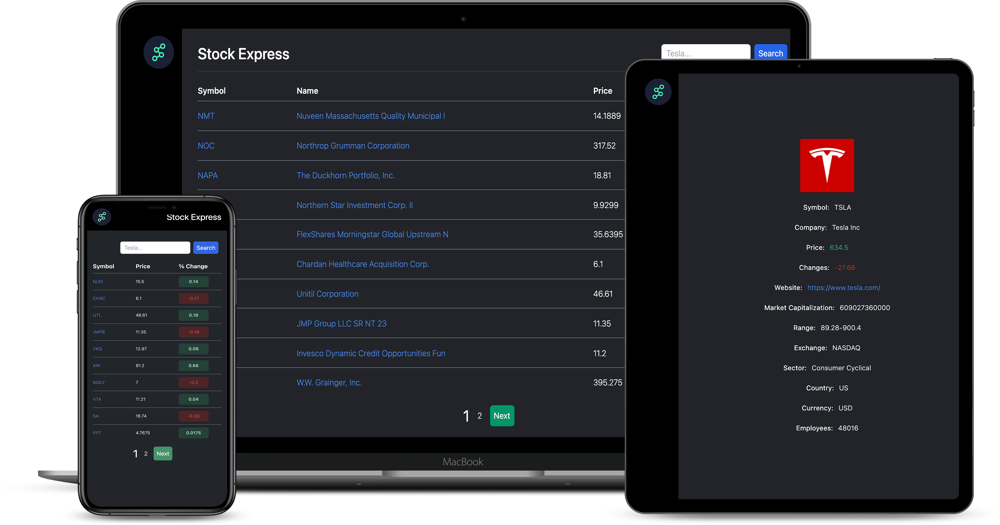
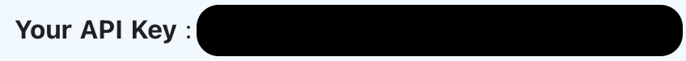
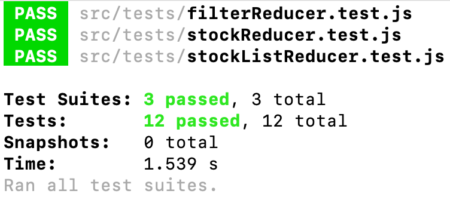

# Stock Express 🚀


## Library Directory 📙

| Contents                  |
| ------------------------- |
| [Built With](#built-with) |
| [Live Demo](#live-demo)   |
| [Install](#install)   |
| [Testing](#testing)   |
| [Authors](#authors)       |
| [License](#license)       |

## Description

> I have created a web-application that lets you check the stock market while all information is being retrieved from an API.



I have built this responsive SPA (Single Page Application) using React, Redux and Tailwind CSS. I added pagination to handle large amounts of data and an option to filter the stocks by searching.

Reference: Catalogue of Dog Clothes

## Built With 🛠

```
- React
- Redux
- JavaScript
- Tailwind CSS
- Netlify
- VS Code
```


## Live Demo 🎥

<a href="https://605b933ea50aa800085c5236--peaceful-visvesvaraya-32f656.netlify.app/"> LIVE DEMO! </a>

## Install ⏳

> Follow these steps below to get my Application working. I used [npm](https://www.npmjs.com/) to manage all my packages for React. If you don't have it installed already, you can install it [here](https://www.npmjs.com/get-npm)

1. - [ ] Open your `Terminal`
2. - [ ] Navigate to the directory where you will like to install the repo by running `cd stock-express`
3. - [ ] Run `git clone git@github.com:DcRonan/stock-express.git` to download <b>or</b> you can download using `HTTPS` by running `git clone https://github.com/DcRonan/stock-express.git` in the terminal
4. - [ ] Run `cd stock-express` to enter the directory
5. - [ ] Run `npm i` to install all the packages
6. - [ ] Click [here](https://financialmodelingprep.com/login) to create an account and retrieve your own API key
7. - [ ] Click on Dashboard to access your API key or find it in the docs section like so:

8. - [ ] Open a text editor, `VS Code` for an example
9. - [ ] Create a `.env` file in your project root directory
10. - [ ]  In the `.env` file, copy and paste `REACT_APP_STOCK_EXPRESS_API_KEY=YOUR_API_KEY_HERE`
11. - [ ] Run `npm start` and the app will open


## Testing ⚙

> I have used React's own testing library to test my code, you can have a look through here: [React Testing Library](https://github.com/testing-library/react-testing-library)

1. - [ ] Open `Terminal` again
2. - [ ] Run `cd stock-express` to enter the directory
3. - [ ] Run `npm test` to start testing
4. - [ ] All tests will pass ✅



## Authors

### 👨‍💻 Daniel Ronan

[](https://github.com/DcRonan) <br>
[](https://www.linkedin.com/in/dan-ronan/) <br>
[](mailto:danielconnorronan@gmail.com) <br>
[](https://twitter.com/dc_ronan)

### Acknowledgements ⭐

Design by [Kevin Dukkon](https://dribbble.com/Kevinduk) - Design [here](https://dribbble.com/shots/14504056--Watchlist-Stocklabs)

### 🤝 Contributing

Contributions, issues and feature requests are welcome!

Feel free to check the [issues page](https://github.com/DcRonan/stock-express/issues).

### Show your support

Give a ⭐️ if you like this project!

### License


